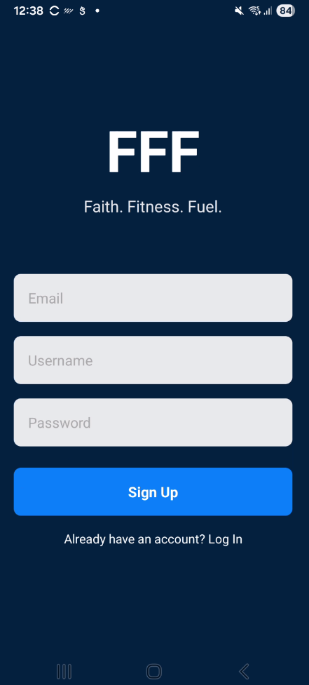
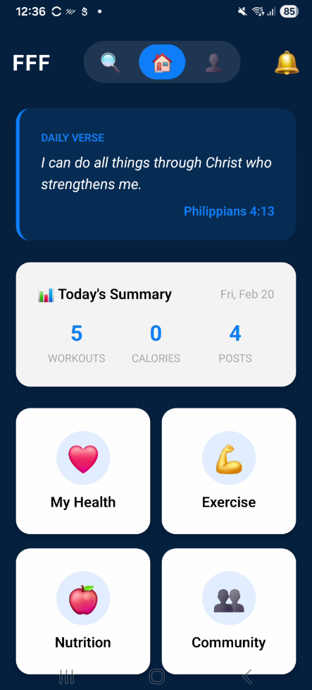
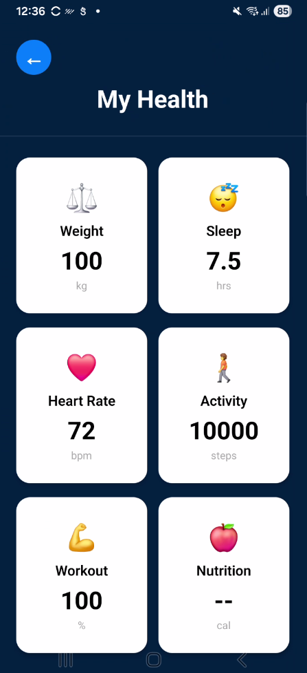
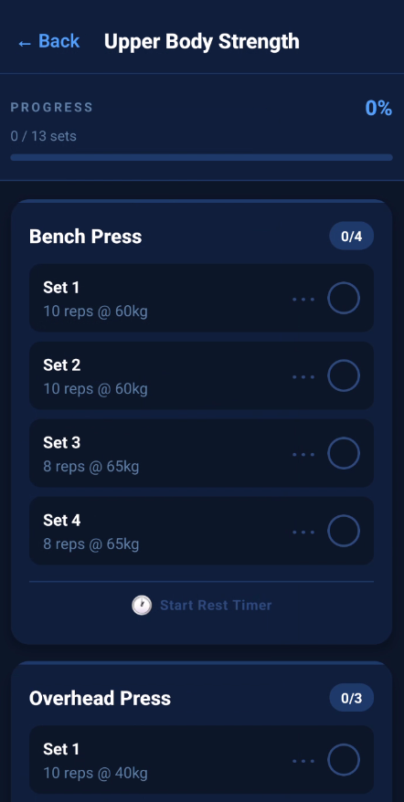
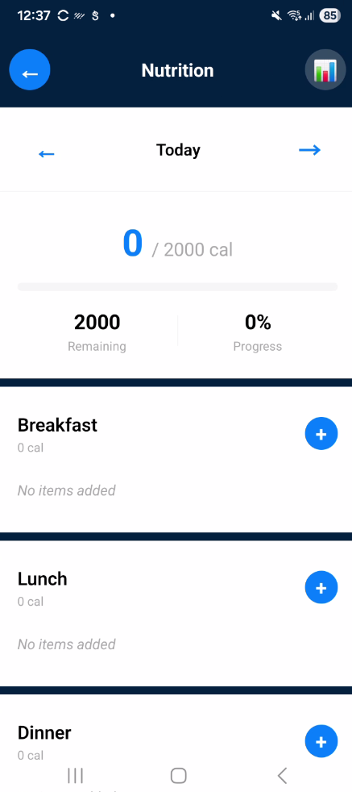
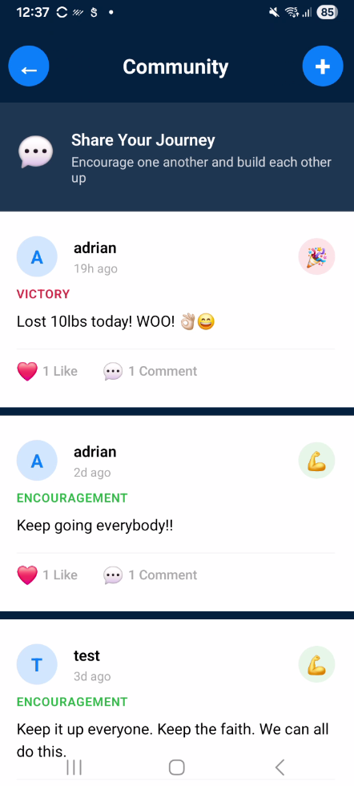
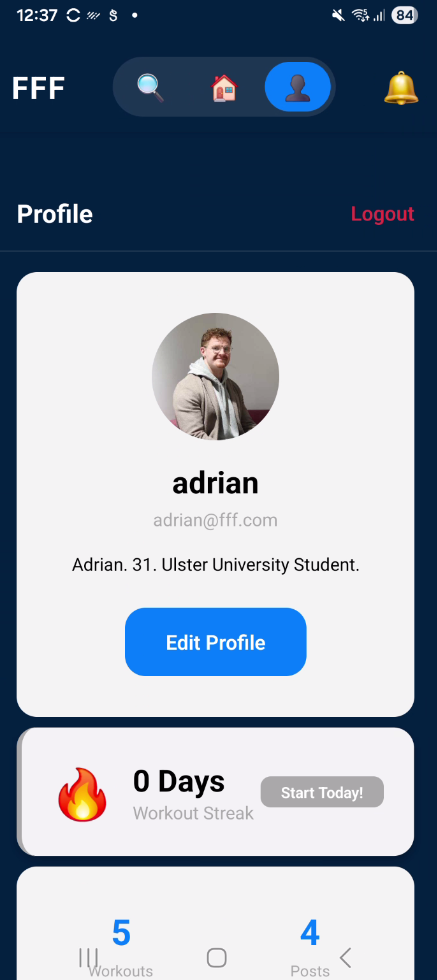

# Faith-Fueled Fitness (FFFApp) 🏋️‍♂️

A cross-platform mobile fitness app built with React Native (Expo), integrating workouts, nutrition tracking, health metrics, community features, and daily faith-based motivation.

> **COM668 Computing Project** · Ulster University · Adrian Dallas (B00902149)

---

## 🎬 Demo

[](https://youtu.be/B0vKgBGfV-c)

▶️ **[Watch Full Demo on YouTube](https://youtu.be/B0vKgBGfV-c)**

---

## 📱 Screenshots

| Signup | Dashboard | My Health |
|-------|-----------|-----------|
|  |  |  |

| Exercise | Nutrition | Community |
|----------|-----------|-----------|
|  |  |  |

| Profile | | |
|---------|--|--|
|  | | |

---

## Tech Stack

| Layer | Technology |
|-------|------------|
| Frontend | React Native, Expo |
| State | Redux Toolkit |
| Navigation | React Navigation |
| Backend | Node.js, Express |
| Database | MongoDB Atlas |
| Auth | JWT / Firebase |
| UI | NativeBase |

## Key Features

- 🔐 JWT Authentication (login / register)
- 📊 Unified health dashboard (weight, sleep, BPM, activity)
- 💪 Exercise database with video demos and ratings
- 🥗 Nutrition logging with calorie tracking
- 👥 Community newsfeed — post workouts, leave reviews
- 📖 Daily Bible verse integration
- 🔍 Exercise search by name, muscle group, equipment

## Project Structure
```
FFFApp/
├── backend/           # Node.js / Express API
│   ├── models/        # Mongoose schemas
│   ├── routes/        # REST endpoints (~20-25 routes)
│   └── server.js
├── src/
│   ├── components/    # Reusable UI components
│   ├── screens/       # App screens
│   ├── navigation/    # React Navigation setup
│   └── store/         # Redux slices
├── screenshots/       # App screenshots
└── App.tsx
```

## Getting Started
```bash
# Install dependencies
npm install
cd backend && npm install && cd ..

# Configure environment
cp backend/.env.example backend/.env
# Add your MongoDB URI and JWT secret

# Run
npm start             # Expo (frontend)
cd backend && npm start  # Backend API
```

## Contact

**Adrian Dallas** · B00902149  
📧 [amccrea354@gmail.com](mailto:amccrea354@gmail.com)  
🔗 [LinkedIn](https://www.linkedin.com/in/adriandallas1995/) | [Portfolio](#)