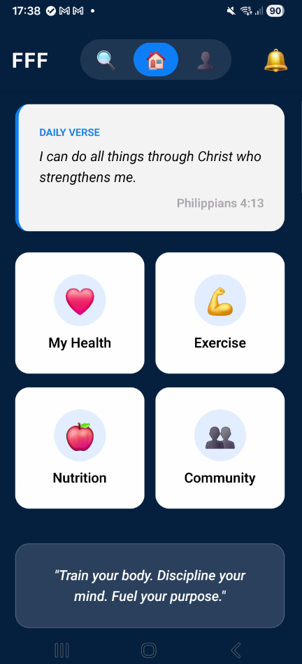

# Faith-Fueled Fitness (FFF) App

Mobile fitness app integrating workouts, nutrition tracking, health metrics, and faith-based motivation.
## ��� Demo
**[Watch Demo Video](#)** _(Coming soon_
**Screenshots:**
| Dashboard | Exercise Search | Nutrition Tracking |
|-----------|----------------|-------------------|
|  |  |  |

## Tech Stack
- **Frontend**: React Native (Expo)
- **Backend**: Node.js + Express
- **Database**: MongoDB Atlas
- **State**: Redux Toolkit
- **Navigation**: React Navigation
## Key Features
✅ JWT Authentication  
✅ Exercise database with video demos  
✅ Nutrition logging with calorie tracking  
✅ Community feed for sharing progress  
✅ Health metrics dashboard  
✅ Daily Bible verses integration  
## Project Structure
```
FFFApp/
├── backend/           # Node.js API
│   ├── models/        # Mongoose schemas
│   ├── routes/        # API endpoints
│   └── server.js
├── src/
│   ├── components/    # Reusable UI components
│   ├── screens/       # App screens
│   ├── navigation/    # React Navigation setup
│   └── store/         # Redux store
└── App.tsx
```
## Setup & Installation
```bash
# Install dependencies
npm install
cd backend && npm install && cd ..

# Configure environment
cp backend/.env.example backend/.env
# Add your MongoDB URI and JWT secret
# Start development
npm start              # Frontend (Expo)
cd backend && npm start  # Backend
```
## Technical Highlights

- **Clean Architecture**: Separation of concerns with Redux slices
- **RESTful API**: Scalable backend with MongoDB
- **Cross-platform**: Single codebase for iOS/Android
- **Faith Integration**: Bible API for daily verses
## Challenges Solved

1. **State Management**: Redux Toolkit for complex app state
2. **Video Playback**: Optimized expo-av for exercise demos
3. **Data Sync**: Real-time health metrics from external APIs
## Future Enhancements

- [ ] Offline mode with local storage
- [ ] Push notifications for workout reminders
- [ ] Social sharing features
- [ ] Apple Health / Google Fit integration

## Contact

**Dallas Adrian**  
[LinkedIn](#) | [Portfolio](#) | [Email](mailto:amccrea354@gmail.com)
---

*Built as part of COM668 Computing Project*
